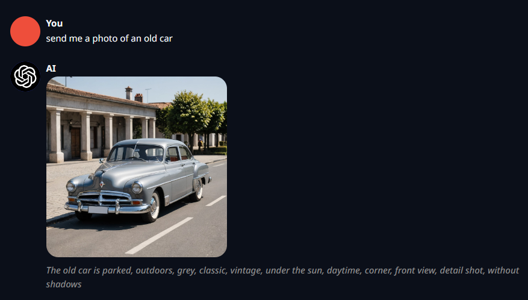

# Stable Diffusion Extension for text-generation-webui
Integrates image generation capabilities to [text-generation-webui](https://github.com/oobabooga/text-generation-webui) using Stable Diffusion.  
Requires stable-diffusion-webui with enabled API.

> [!WARNING]  
> DO NOT DOWNLOAD OR CLONE THIS REPOSITORY AS-IS. PLEASE FOLLOW THE [THE INSTALLATION INSTRUCTIONS](#installation) INSTEAD. YOU <u>WILL</u> GET ERRORS OTHERWISE.  
  
**Demo:**  

  
   

> [!WARNING]  
> This extension has been mainly developed with [SD.Next](https://github.com/vladmandic/automatic) instead of [AUTOMATIC1111](https://github.com/AUTOMATIC1111/stable-diffusion-webui). Please report any potential bugs you come across when using AUTOMATIC1111 instead.  

> [!NOTE]  
> Some features, such as IP Adapter, FaceID and clip skip, are only available when using SD.Next.

## Features
- Dynamically generate images in text-generation-webui chat by utlizing the SD.Next or AUTOMATIC1111 API.
- Well documented [settings](./settings.debug.yaml) file for quick and easy configuration.
- Configure image generation parameters such as width, height, sampler, sampling steps, cfg scale, clip skip, seed, etc.
- Post process generated images including upscaling, face restoration and HiRes.fix.
- Run stable-diffusion-webui and text-generation-webui on the same GPU even on low VRAM GPUs using the dynamic VRAM allocation feature.
- Use various image generation modes such as continous (generate image on each message) and interactive (generate image if asked so in chat).
- Define generation rules for when and how to generate images. Can be used for character specific prompts and parameters, dynamically adding LoRAs on triggerwords, etc.
- Face swap for generating consistent character images using FaceLabSwap, ReActor or FaceID (see [Ethical Guidelines](#ethical-guidelines)).
- Generate images based roughly on a base reference image using IP Adapter.

## Supported Stable Diffusion WebUI Extensions and Features
- [FaceSwapLab](https://github.com/glucauze/sd-webui-faceswaplab)
- [ReActor](https://github.com/Gourieff/sd-webui-reactor)
- [FaceID](https://github.com/vladmandic/automatic) 
  - Can be used to force a specific face to be used while generating images.
  - Unlike FaceSwapLab and ReActor, FaceID supports various art styles such as cartoon, anime, etc.
  - Requires SD.Next.
  - The insightface, ip_adapter and onnxruntime-gpu PIP packages must be installed for SD.Next first.
- [IP Adapter](https://github.com/vladmandic/automatic) 
  - Can be used to generate images based roughly on a base reference image.
  - Requires SD.Next.
  - The ip_adapter and onnxruntime-gpu PIP packages must be installed for SD.Next first.

## Installation
- Open a shell with cmd_linux.sh/cmd_macos.sh/cmd_windows.bat inside your text-generation-webui folder. 
- Run `git clone https://github.com/Trojaner/text-generation-webui-stable_diffusion extensions/stable_diffusion`.
- Run `pip install -r extensions/stable_diffusion/requirements.txt` to install the required dependencies.	
- Open the [settings.debug.yaml](./settings.debug.yaml) file, copy the extension related settings to your own settings.json in the text-generation-webui directory.
- Add `stable_diffusion` to the enabled extensions in settings.json.

## Development Environment Setup

**Pre-requisites**  
text-generation-webui, Visual Studio Code and Python 3.10 are required for development.  

**Setting up Visual Studio Code for development**
- [Install the extension first](#installation) if you haven't already.
- Start Visual Studio Code and open the stable_diffusion directory, then trust the repository if it asks you for it.
- Install the [recommended extensions](./.vscode/extensions.json) as they are required for code completion, linting and auto formatting.
- Adjust `.vscode/launch.json` to use your preferred model for debugging or install the default model [mistral-7b-instruct-v0.1.Q5_K_M.gguf](https://huggingface.co/TheBloke/Mistral-7B-v0.1-GGUF/blob/main/mistral-7b-v0.1.Q5_K_M.gguf) instead.
- Adjust `settings.debug.yaml` if needed. These settings will be used during debugging.
- Once you want to test your changes, hit F5 (*Start Debugging*) to debug text-generation-webui with this extension pre-installed and with the `settings.debug.yaml` file as the settings file. You can also use Ctrl + Shift + F5 (*Restart Debugging*) to apply any changes you made to the code by restarting the server from scratch. Checkout [Key Bindings for Visual Studio Code](https://code.visualstudio.com/docs/getstarted/keybindings) for more shortcuts.  
- Be sure to check out the [Contribution Guidelines](#contribution-guidelines) below before submitting a pull request.

## Contribution Guidelines
- This project relies heavily on type hints, please make sure to add them to your code as well or your pull request will likely get rejected.
- Always reformat your code using [Black](https://github.com/psf/black) and [isort](https://github.com/PyCQA/isort) before committing (it should already do so when saving files if you have installed the recommended extensions).
- Make sure that both, [mypy](https://github.com/python/mypy) and [flake8](https://github.com/PyCQA/flake8), are not outputting any linting errors.
- Prefix local functions and variables with an underscore (`_`) to indicate that they are not meant to be used outside of the current file
- Use snake case when naming functions and variables, pascal case when naming classes and uppercase for constants.
- Do not use abbreviations for variable names (such as `ctx` instead of `context`) unless they are simple and common like `i` for index or `n` for number.
- Always document and include new parameters in the `settings.debug.yaml` file.
- Last but not least, ensure that you do not accidentally commit changes you might have made to the `settings.debug.yaml` or `launch.json` files unless intentional.

## Ethical Guidelines
This extension integrates with various face swap extensions for stable-diffusion-webui and hence allows to swap faces in the generated images. This extension is not intended for the creation of non-consensual deepfake content. Please use this extension responsibly and do not use it to create such content. The main purpose of the face swapping functionality is to allow the creation of consistent images for text-generation-webui characters. If you are unsure whether your use case is ethical, please refrain from using this extension.

The maintainers and contributors of this extension cannot be held liable for any misuse of this extension but will try to prevent such misuse by all means.

## Todo
- ~~Some basic Gradio UI for fine-tuning the extension parameters at runtime~~
- ~~Support [ReActor](https://github.com/Gourieff/sd-webui-reactor) as alternative faceswap integration [[api implementation](https://github.com/Gourieff/sd-webui-reactor/blob/main/scripts/reactor_api.py)]~~ 
- ~~Character specific parameters~~
- Integrate with aDetailer extension for stable-diffusion-webui.
- Integrate with other SD extensions / scripts?
- Add tag system for grouping rules and making them mutually exclusive or dependent.
- Add a sentiment analysis for defining image generation rules based on the sentiment of the generated text.
- Add a custom LogitsProcessor or grammar implementation for generating proper and weighted SD image generation prompts.

## See also
- [sd_api_pictures](https://github.com/oobabooga/text-generation-webui/tree/main/extensions/sd_api_pictures) - the original stable-diffusion-webui extension which inspired this one
- [sd_api_pictures_tag_injection](https://github.com/GuizzyQC/sd_api_pictures_tag_injection) - a fork of sd_api_pictures with tag injection support

## License
[MIT](./LICENSE)
